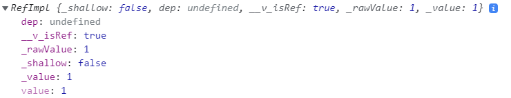

# 如何理解响应式

先举两个生活中的例子：  

肚子呱呱叫 - 进食  
全身哆嗦 - 穿衣  

当我们的身体发生一些生理变化时，就会做出相应的反应。完成上面的过程包含了两个关键要素：变化源和反应行为。  

在 Vue 中，数据模型就是变化源，视图更新就是反应行为，整个响应式过程就是：数据模型变化时，视图会进行更新。  

有了需求描述，接下来就该思考如何实现了。  

我们先通过一个简单的求和示例来说明响应式。  
```js
let val1 = 1
let val2 = 2

let sum = val1 + val2
console.log(sum)    // 3

val1 = 3    // val1发生变化
console.log(sum)    // 仍然是3
```
这里的数据模型是 `val1` 和 `val2`，反应行为是对其进行求和。对于反应行为，Vue 中有专门的称谓 - 副作用（`effect`），视图更新本质也是一种副作用。  

当数据模型变化时，`sum` 的值并没有更新。想要实现预期的响应式，我们需要做到下面几点：  

1.  **追踪变化源** - 当一个值被读取时进行追踪，例如 val1 + val2 会同时读取 val1 和 val2。  
2.  **通知更新** - 当某个值改变时进行检测，例如，当我们赋值 val1 = 3。  
3.  **副作用** - 重新运行代码来读取最新值，例如，再次运行 sum = val1 + val2 来更新 sum 的值。

下面就让我们逐一实现这三点。  

<br/>

# 追踪变化源

在 JavaScript 中没有追踪变量取值/赋值的机制，我们可以跟踪的是对象属性的取值/赋值。因此，就需要通过一种办法将变量的取值/赋值转换为对象上某个属性的取值/赋值。  

Vue3 中给出的解决方案是 `ref`。  
```js
let val = 1
const refObj = ref(val)     // 转换成对象

console.log(refObj)
```
通过 `ref` API，我们成功的将变量转换成了对象，那么原始数据 `val` 到底是映射到了对象 `refObj` 的哪个属性上呢。打印下 `refObj` 便知究竟。  



这里的 `_rawValue` 、 `_value` 和 `value` 都和原始值相同，但在 Vue 中约定以下划线开头的都是内部私有属性，所以暂且让我们将关注点聚焦到 `value` 上。  

这一步的最终目标是在获取对象属性值的时候对其进行追踪。  

通过 JavaScript 中的 [getter](https://developer.mozilla.org/zh-CN/docs/Web/JavaScript/Reference/Functions/get) 语法将对象属性的查询绑定到一个函数上，这样就能保证在正常获取属性值的同时还能进行其它自定义操作，例如我们的追踪。  

这里我们脱离 Vue 来实现类似的追踪功能。  
```js
let activeEffect    // 当前副作用

class RefImpl {
  _value
  dep   // 依赖

  constructor(value) {
    this._value = value
  }

  get value() {
    track(this)
    return this._value
  }
}

// 对外暴露的 API
export function ref(value) {
  return new RefImpl(value)
}

// 追踪
function track(ref) {
  if (!ref.dep) {
    ref.dep = new Set()
  }
  ref.dep.add(activeEffect)
}
```
通过追踪我们将 `value` 属性和 `activeEffect` 记录在了一起，这样我们就知道了 `value` 是当前副作用的依赖。  

<br/>

# 通知更新

通知更新是在对象属性值发生变化时触发的。同样的，通过 JavaScript 中的 [setter](https://developer.mozilla.org/zh-CN/docs/Web/JavaScript/Reference/Functions/set) 语法将对象属性值的设置绑定到一个函数上，这样就能在设置属性值的同时通知更新。  

我们继续在追踪变化源的基础上实现。  
```js
class RefImpl {
  // ...

  set value(newVal) {
    if (newVal !== this._value) {
      // 属性值发生变化时通知更新
      this._value = newVal
      trigger(this)
    }
  }
}

// 通知更新
function trigger(ref) {
  if (ref.dep) {
    for (const effect of ref.dep) {
      effect()
    }
  }
}
```

<br />

# 副作用

为了能够在数值变化时重新求和，我们应当将求和逻辑包裹在一个函数中以便能够随时调用。  
```js
const sumUpdateFn = () => {
  sum = val1 + val2
}
```
副作用就是这个包裹器，类似于这样。  
```js
effect(() => {
  sum = val1 + val2
})
```
副作用是 Vue 中许多功能的关键点，例如，组件的渲染和计算属性在内部都使用了副作用，任何响应式的变化都与副作用脱不了干系。  

让我们脱离 Vue 实现一个简化版的副作用。  
```js
let effectStack = []  //副作用栈

export function effect(fn) {
  const _effect = () => {
    activeEffect = _effect
    effectStack.push(effect)
    fn()
    effectStack.pop(effect)
  }
  
  _effect()  // 立即自动执行副作用

  return _effect
}
```


<br />

# 验证响应式

有了前面三个功能点的实现，我们将求和的示例进行修改来验证响应式。  
```js
let val1 = ref(1)
let val2 = ref(2)
let sum

const sumUpdateEffect = effect(() => {
  sum = val1.value + val2.value
})
console.log(sum)   // 3

val1.value = 3
console.log(sum)   // 5
```
至此，我们就完成了一个基础的响应式实现。回头看我们调用 `ref` API 的初衷是为了解决简单数据无法追踪变化源和通知更新的问题。如果我们的数据源原本就是对象，自然就不需要 `ref` 再做一层包装，这个时候 [Proxy](https://developer.mozilla.org/zh-CN/docs/Web/JavaScript/Reference/Global_Objects/Proxy) 对象代理就该上场了。  

<br />

# 响应式对象 
>`Proxy` 对象用于创建一个对象的代理，从而实现基本操作的拦截和自定义（如属性查找、赋值、枚举、函数调用等）。    

Vue3 的 `reactive` API 就是基于 `Proxy` 的实现，它可以将对象进行深度响应式转换。下面就让我们来实现一个基本的 `reactive`。  

在开始之前，先对之前的求和示例进行修改，将数据源由基本类型调整为对象类型。  
```js
let data = {
  val1: 1,
  val2: 2
}

let sum = data.val1 + data.val2
console.log(sum)

data.val1 = 3
console.log(sum)
```

通过 `Proxy` 拦截对象属性设置和读取的操作，添加追踪依赖和通知更新的自定义行为。  

```js
const proxyMap = new WeakMap()
const targetMap = new WeakMap()

export function reactive(target) {
  const proxy = new Proxy(target, {
    get(target, key, receiver) {
      const res = Reflect.get(target, key, receiver)
      track(target, key)
      return res
    },
    set(target, key, value, receiver) {
      const oldValue = target[key]
      const res = Reflect.set(target, key, value, receiver)
      if (value !== oldValue) {
        trigger(target, key)
      }
      return res
    }
  })
  proxyMap.set(target, proxy)
  return proxy
}

// 依赖收集
function track(target, key) {
  let depsMap = targetMap.get(target)
  if (!depsMap) {
    targetMap.set(target, (depsMap = new Map()))
  }
  let dep = depsMap.get(key)
  if (!dep) {
    depsMap.set(key, (dep = new Set()))
  }
  dep.add(activeEffect)
}

// 通知更新
function trigger(target, key) {
  const depsMap = targetMap.get(target)
  if (!depsMap) {
    return
  }
  const deps = depsMap.get(key)
  if (!deps) {
    return
  }
  for (const effect of deps) {
    effect()
  }
}
```

现在，我们用下面的示例来验证 `reactive` 响应式是否生效。  
```js
let data = reactive({
  val1: 1,
  val2: 2
})
let sum
const sumUpdateEffect = effect(() => {
  sum = data.val1 + data.val2
})
console.log(sum)  // 3

data.val1 = 3
console.log(sum)  // 5
```

